# Insurance Policy Review with Dynamic Workflows

[](https://www.python.org/downloads/)

A markdown-first [Azure Functions hosted skill](https://azure.github.io/azure-functions-agents-runtime/)
that creates a durable workflow to review the documents required to add a driver to
an auto insurance policy. Its trigger and instructions live in
[src/main.agent.md](src/main.agent.md), and Azure Functions handles execution and
scale-to-zero.

## What it does

- 📥 **Starts from an event:** an add-driver request arrives on an Azure Storage queue.
- 🔀 **Plans durable work:** the hosted skill creates a workflow for the request.
- 📄 **Checks documents in parallel:** one activity runs for each submitted document.
- 📝 **Builds a review:** the results are combined into an HTML report in Blob Storage.
- 👤 **Keeps the decision human-owned:** the sample never updates the policy or makes a
  policy decision.

## Prerequisites

- An [Azure subscription](https://azure.microsoft.com/free/)
- [uv](https://docs.astral.sh/uv/)
- [Azure Developer CLI (`azd`)](https://learn.microsoft.com/azure/developer/azure-developer-cli/install-azd)

## Quickstart

Deploy the sample:

```bash
azd auth login
azd up
```

Load the deployed Storage settings:

```bash
export POLICY_REVIEW_STORAGE_URL="$(azd env get-value POLICY_REVIEW_STORAGE_URL)"
export POLICY_REVIEW_QUEUE_URL="$(azd env get-value POLICY_REVIEW_QUEUE_URL)"
export POLICY_REVIEW_CONTAINER="$(azd env get-value POLICY_REVIEW_CONTAINER)"
export POLICY_REQUEST_QUEUE="$(azd env get-value POLICY_REQUEST_QUEUE)"
```

Submit the included request:

```bash
uv run --with-requirements requirements.txt python scripts/demo.py submit
```

Follow the run in the Durable Task Scheduler dashboard:

```bash
azd env get-value DURABLE_TASK_DASHBOARD_URL
```

After `publish_driver_review_report` completes, download the report:

```bash
uv run --with-requirements requirements.txt python scripts/demo.py download
```

You should see:

| Request | Document results | Decision |
|---|---|---|
| Add Jordan Lee to `AUTO-100042` | Driver's license present; signed request missing | Human review required |

The report is saved to `output/PSR-2026-00042.html`.

Clean up with `azd down --purge`.

## Run it locally

Install [Azurite](https://learn.microsoft.com/azure/storage/common/storage-use-azurite),
[Azure Functions Core Tools](https://learn.microsoft.com/azure/azure-functions/functions-run-local),
Docker, and Azure CLI. Copy the settings template and set the model endpoint and
deployment:

```bash
cp src/local.settings.template.json src/local.settings.json
az login
```

Run each command in a separate terminal:

```bash
azurite --silent --skipApiVersionCheck --location .azurite       # terminal A
docker run --rm --name dts-emulator \
  -e DTS_TASK_HUB_NAMES=policyreviews \
  -p 8080:8080 -p 8082:8082 \
  mcr.microsoft.com/dts/dts-emulator:latest                     # terminal B
cd src && uv run --with-requirements requirements.txt func start # terminal C
uv run --with-requirements requirements.txt python scripts/demo.py submit  # terminal D
```

Open <http://localhost:8082> to follow the workflow, then download the report:

```bash
uv run --with-requirements requirements.txt python scripts/demo.py download
```

The model call still uses Azure. For setup and Windows help, see
[Troubleshooting](docs/troubleshooting.md).

## How it works

```mermaid
flowchart LR
    request([add-driver request])
    queue[[policy-service-requests]]
    skill{{Add Driver Review<br/>hosted skill}}
    scheduler[(Durable Task Scheduler)]
    validate[validate request]
    inspect[inspect documents<br/>in parallel]
    report[build HTML review]
    blob[(policy-review-packets)]
    reviewer([human reviewer])

    request --> queue
    queue -->|queue trigger| skill
    skill -->|start workflow| scheduler
    scheduler --> validate --> inspect --> report --> blob --> reviewer
```



The runtime discovers [src/main.agent.md](src/main.agent.md). Its front matter defines
the queue trigger and enables workflows; its body describes the four steps. The Python
tools in [src/tools/policy_review_tools.py](src/tools/policy_review_tools.py) validate
the request, inspect document metadata, build the report, and publish it using managed
identity.

[How it works](docs/how-it-works.md) ·
[Use cases](docs/use-cases.md) ·
[Customize](docs/customize.md) ·
[Deploy](docs/deploy.md) ·
[Troubleshooting](docs/troubleshooting.md)

## Learn more

- [Azure Functions hosted skills](https://azure.github.io/azure-functions-agents-runtime/)
- [Dynamic Workflows](https://azure.github.io/azure-functions-agents-runtime/workflows/)
- [Azure Functions Flex Consumption](https://learn.microsoft.com/azure/azure-functions/flex-consumption-plan)
- [Durable Task Scheduler](https://learn.microsoft.com/azure/azure-functions/durable/durable-task-scheduler/durable-task-scheduler)
- [uv](https://docs.astral.sh/uv/)
