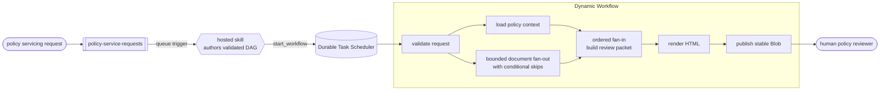

# Insurance Policy Review with Dynamic Workflows [](https://www.python.org/downloads/)

A queue-driven [Azure Functions hosted skill](https://azure.github.io/azure-functions-agents-runtime/)
that creates a durable review workflow for insurance policy servicing requests. The
skill definition lives in [`src/main.agent.md`](src/main.agent.md), and its deterministic
workflow handlers live in
[`src/tools/policy_review_tools.py`](src/tools/policy_review_tools.py).

[Dynamic Workflows](https://azure.github.io/azure-functions-agents-runtime/workflows/)
are currently available as public experimental v1. This sample prepares evidence for
an authorized human reviewer. It never approves, denies, prices, underwrites, binds,
cancels, renews, or changes a policy.

## What it does

- **Starts from an event:** a JSON policy servicing request arrives on the
  `policy-service-requests` queue.
- **Plans durable work:** the hosted skill authors one validated workflow DAG and starts
  it without waiting for completion.
- **Inspects documents in parallel:** a bounded `for_each` checks up to eight document
  metadata records, while `when` skips document kinds outside the sample's scope.
- **Preserves the full result:** ordered fan-in keeps each source index, including
  skipped entries, before the packet is assembled.
- **Publishes a review packet:** the final activity renders HTML and overwrites a stable
  Blob destination so retries remain safe.
- **Keeps the decision human-owned:** every packet has
  `review_status: human_review_required` and `decision: null`.

The model reasons about the workflow plan. The workflow activities themselves are
synchronous, deterministic Python functions and do not call a model.

## Prerequisites

- An [Azure subscription](https://azure.microsoft.com/free/) with permission to create
  resources and role assignments
- [Python 3.13](https://www.python.org/downloads/)
- [Azure Developer CLI (`azd`)](https://learn.microsoft.com/azure/developer/azure-developer-cli/install-azd)

## Quickstart

Create a Python environment, sign in, and deploy:

```bash
python3.13 -m venv .venv
source .venv/bin/activate
python -m pip install -r requirements.txt

azd auth login
azd up
```

Load the deployed Storage endpoints into the same terminal:

```bash
export POLICY_REVIEW_STORAGE_URL="$(azd env get-value POLICY_REVIEW_STORAGE_URL)"
export POLICY_REVIEW_QUEUE_URL="$(azd env get-value POLICY_REVIEW_QUEUE_URL)"
export POLICY_REVIEW_CONTAINER="$(azd env get-value POLICY_REVIEW_CONTAINER)"
export POLICY_REQUEST_QUEUE="$(azd env get-value POLICY_REQUEST_QUEUE)"
```

Submit the included request:

```bash
python scripts/demo.py submit
```

Follow the workflow in the Durable Task Scheduler dashboard:

```bash
azd env get-value DURABLE_TASK_DASHBOARD_URL
```

Open the dashboard URL and wait for `publish_policy_review_packet` to complete, then
download the report:

```bash
python scripts/demo.py download
```

The default scenario produces:

| Item | Expected result |
|---|---|
| Request | `PSR-2026-00042`, add a driver to `AUTO-100042` |
| Document fan-out | Three in-scope records inspected, one customer note skipped |
| Review packet | `human_review_required`, with no policy decision |
| Blob | `policy-review-packets/reviews/PSR-2026-00042.html` |

Clean up with `azd down --purge`.

## Run locally

Local execution also requires:

- [Azure Functions Core Tools 4](https://learn.microsoft.com/azure/azure-functions/functions-run-local)
- [Azurite](https://learn.microsoft.com/azure/storage/common/storage-use-azurite)
- [Azure CLI](https://learn.microsoft.com/cli/azure/install-azure-cli)
- Docker (required for the Durable Task Scheduler emulator)

Copy [`src/local.settings.template.json`](src/local.settings.template.json) to
`src/local.settings.json`, set `FOUNDRY_PROJECT_ENDPOINT` and `FOUNDRY_MODEL`, then
authenticate with `az login`. Start Azurite, the Durable Task Scheduler emulator, and
the Functions host. The model call still uses Azure. If you deployed with `azd up`, use
`azd env get-value FOUNDRY_PROJECT_ENDPOINT` and `azd env get-value FOUNDRY_MODEL` for
the local settings values.

```bash
cp src/local.settings.template.json src/local.settings.json
az login
azurite --silent --skipApiVersionCheck --location .azurite     # terminal A
docker run --rm --name dts-emulator \
  -e DTS_TASK_HUB_NAMES=policyreviews \
  -p 8080:8080 -p 8082:8082 \
  mcr.microsoft.com/dts/dts-emulator:latest                   # terminal B
cd src && source ../.venv/bin/activate && func start           # terminal C
source .venv/bin/activate && python scripts/demo.py submit     # terminal D
```

Open <http://localhost:8082> to inspect the workflow, then run
`python scripts/demo.py download` from the repository root.

For PowerShell setup, see [Windows local development](docs/troubleshooting.md#windows-local-development).

## How it works



The queue-triggered skill has no response channel, so the Blob publisher is the
workflow's terminal sink. Durable Functions executes the plan, while the configured
Durable Task Scheduler backend holds workflow state and exposes status. Activity
execution can be at least once, so the terminal publisher is idempotent.

[How it works](docs/how-it-works.md) |
[Use cases](docs/use-cases.md) |
[Customize](docs/customize.md) |
[Deploy](docs/deploy.md) |
[Troubleshooting](docs/troubleshooting.md)

## Learn more

- [Dynamic Workflows](https://azure.github.io/azure-functions-agents-runtime/workflows/)
- [Azure Functions hosted skills](https://azure.github.io/azure-functions-agents-runtime/)
- [Durable Functions](https://learn.microsoft.com/azure/azure-functions/durable/durable-functions-overview)
- [Azure Developer CLI](https://learn.microsoft.com/azure/developer/azure-developer-cli/)
