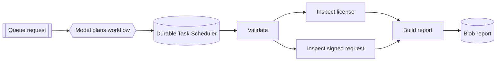

# How it works

A JSON request on the `policy-service-requests` queue starts the hosted skill in
[src/main.agent.md](../src/main.agent.md). The model creates a four-step workflow and
Durable Task Scheduler runs it in the background.

## The four steps

1. `validate_add_driver_request` validates the policy, driver, document metadata, and
   report destination.
2. `inspect_driver_document` runs once for each submitted document. These activities
   can run in parallel.
3. `build_driver_review_report` joins the ordered inspection results and creates HTML.
4. `publish_driver_review_report` writes the HTML to Blob Storage.

The activities are regular synchronous Python functions in
[src/tools/policy_review_tools.py](../src/tools/policy_review_tools.py). They do not call
a model.

## Why use a Dynamic Workflow?

The request controls how many document activities run. The workflow can run those
activities in parallel, preserve their results, survive restarts, and expose progress
in the scheduler dashboard.



## Human decision boundary

The generated result always contains:

```json
{
  "review_status": "human_review_required",
  "decision": null
}
```

The sample checks metadata such as `received`, `missing`, or `expired`. It does not open
a file, verify its authenticity, or decide whether the driver should be added.

## Safe retries

A durable activity can run more than once. The publisher uses the request's stable Blob
name with `overwrite=True`, so a retry updates the same report instead of creating a
duplicate.

Next: [Try variations](use-cases.md) | [Customize](customize.md) |
[Deploy](deploy.md)
