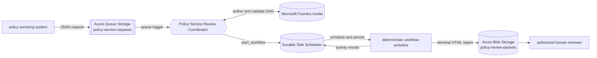

# How it works

A JSON message on the `policy-service-requests` queue starts one run of the
[`Policy Service Review Coordinator`](../src/main.agent.md). The model reads the
request and the skill instructions, authors a validated task graph, and calls
`start_workflow`. The call schedules a Durable Functions orchestration and returns a
workflow ID immediately.

The queue-triggered turn does not wait or poll. Durable execution continues in the
background until the terminal Blob publisher succeeds or the workflow fails.

## Why use a Dynamic Workflow?

A regular queue function can call each dependency in a fixed sequence. This scenario
needs a little more:

- document checks should run independently and in parallel
- only supported document kinds should become activity work
- all results must join in original request order
- execution must survive process restarts and long waits
- operators need status, cancellation, and activity-level visibility
- the event-driven workflow needs a final destination for its result

Dynamic Workflows add model-authored planning to those requirements without replacing
the deterministic systems that load policy context, inspect evidence metadata, build
the packet, or publish the report.

## Architecture



The app runs on Azure Functions Flex Consumption. One user-assigned managed identity
connects the Function App to Storage, Microsoft Foundry, Application Insights, and the
task hub.

## The workflow, step by step

The complete plan is described in [`src/main.agent.md`](../src/main.agent.md):

1. **Validate the request.** `validate_policy_service_request` checks identifiers,
   request structure, document states, duplicate IDs, and the Blob destination. It
   normalizes up to eight document records and sets an `in_scope` flag on each one.
2. **Load policy context.** `load_policy_context` returns a fictional policy fixture
   and the evidence requirements for the requested change. It does not evaluate
   eligibility or make a decision.
3. **Inspect document metadata.** One `for_each` task materializes an
   `inspect_policy_document` activity for each normalized document. A `when` predicate
   runs only entries whose `in_scope` value equals `true`.
4. **Build the review packet.** `build_policy_review_packet` consumes the whole
   validation result, policy result, and ordered document aggregate. It identifies
   missing information, manual checks, and next actions.
5. **Render HTML.** `render_policy_review_html` turns the complete packet into a
   readable report while preserving `decision: null`.
6. **Publish the result.** `publish_policy_review_packet` overwrites the normalized
   Blob name and logs `POLICY_REVIEW_PACKET_PUBLISHED`.

All six handlers are synchronous `@workflow_tool` functions. Each accepts one
dictionary and returns a JSON-serializable result.

## Bounded fan-out and ordered fan-in

The validator limits a request to eight documents. That keeps the sample below the
Dynamic Workflows default safeguards of 50 total authored or materialized nodes and
maximum parallelism of 10.

The document task returns one envelope per source position:

```json
[
  {"index": 0, "status": "completed", "result": {"document_id": "DOC-001"}},
  {"index": 1, "status": "completed", "result": {"document_id": "DOC-002"}},
  {"index": 2, "status": "completed", "result": {"document_id": "DOC-003"}},
  {"index": 3, "status": "skipped", "result": null}
]
```

The packet builder treats those indexes as authoritative. Skipped entries stay
visible, and completed results are processed in the same order as the source array.

## Where model reasoning happens

The model authors the workflow DAG from the queue request and the skill instructions.
The runtime validates that plan against the workflow tool policy before scheduling it.

The activities do not call a model. Policy fixtures, document-state mapping, missing
evidence detection, HTML rendering, and Blob publication are deterministic Python
logic. This sample demonstrates AI-led planning, not automated underwriting or policy
decision-making.

## Human decision boundary

Every successful packet contains:

```json
{
  "review_status": "human_review_required",
  "decision": null,
  "decision_authority": "human_policy_reviewer",
  "automation_scope": "evidence_collection_and_packet_preparation_only"
}
```

The generated HTML tells the reviewer to verify source documents, compare request
fields with the authoritative system, apply current carrier rules, and record the
final decision. The sample never writes a policy decision.

## Managed identity and retries

In Azure, the Function App uses managed identity for all service connections. Shared
key access is disabled on the Storage account. Locally, the same code uses
`UseDevelopmentStorage=true` with Azurite.

Durable activity execution can be at least once. The terminal publisher writes to a
stable request-specific Blob with `overwrite=True`, so a retry produces the same
destination instead of duplicate reports.

## Repository layout

```text
.
|-- azure.yaml                         # azd service definition
|-- examples/
|   `-- policy-service-request.json    # default add-driver request
|-- infra/                             # Bicep for Functions, DTS, Foundry, Storage, monitoring, RBAC
|-- scripts/
|   `-- demo.py                        # submit a request or download a report
|-- src/
|   |-- main.agent.md                  # queue trigger and workflow planning instructions
|   |-- tools/policy_review_tools.py   # six deterministic workflow handlers
|   |-- function_app.py                # hosted skills runtime entry point
|   |-- host.json                      # Durable Task Scheduler backend
|   `-- local.settings.template.json   # local settings reference
`-- tests/                             # tool, workflow, configuration, and deployment contracts
```

Next: [Use cases](use-cases.md) | [Customize](customize.md) |
[Deploy](deploy.md) | [Troubleshooting](troubleshooting.md)
